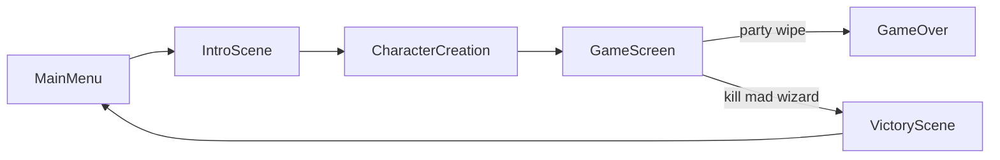

# Mad Wizard Story Feature

## Game Flow Changes

The screen flow becomes:

Two new screens (`intro` and `victory`) are added to the `GameScreen` type union in `[src/types/index.ts](src/types/index.ts)`.

## 1. Dungeon Length Selection

Add a "Short (5 floors)" / "Standard (10 floors)" toggle on the Character Creation screen (`[src/components/screens/CharacterCreation.tsx](src/components/screens/CharacterCreation.tsx)`).

- Store the selected `maxFloor` (5 or 10) in the game state (`[src/stores/gameStore.ts](src/stores/gameStore.ts)`) alongside `currentFloor`
- Pass it through `initNewGame`
- Include `maxFloor` in `GameSave` so it persists across saves

## 2. Mad Wizard Boss

**Monster data** in `[src/data/monsters.ts](src/data/monsters.ts)`:

- Add a `mad_wizard` template with high stats (e.g. HP: 400, ATK: 45, DEF: 20, SPD: 14), `svgComponent: 'MadWizardSVG'`, and good loot drops
- Set `minFloor: 999` so he never appears in random encounters

**SVG** -- create `[src/components/svg/monsters/MadWizardSVG.tsx](src/components/svg/monsters/MadWizardSVG.tsx)`:

- A robed wizard with a staff, crackling energy, wild eyes -- dark/menacing color palette
- Follows existing pattern: `({ size = 120 })` with `viewBox="0 0 120 120"`

**Register** in `[src/components/svg/monsters/index.tsx](src/components/svg/monsters/index.tsx)`:

- Add lazy import and `MONSTER_MAP` entry

## 3. Boss Placement on Final Floor

In `[src/systems/dungeonGenerator.ts](src/systems/dungeonGenerator.ts)`:

- Add a new cell type `'boss'` to `CellType` in `[src/types/index.ts](src/types/index.ts)`
- Accept `maxFloor` parameter in `generateDungeon`
- On the final floor (`floor === maxFloor`): replace the `stairs_down` placement with a `'boss'` cell in the last room's center
- The boss cell is a placed entity (like trader), visible on approach in the dungeon view

## 4. Boss Encounter Logic

In `[src/stores/gameStore.ts](src/stores/gameStore.ts)`:

- When player steps on or interacts with a `'boss'` cell, start a special combat with the Mad Wizard (spawn him directly instead of using random selection)
- On combat victory, if the defeated monsters include `mad_wizard`: set `screen: 'victory'`
- The `endCombat` function or victory handler checks for this condition

**Dungeon view rendering** in `[src/components/dungeon/dungeonViewUtils.ts](src/components/dungeon/dungeonViewUtils.ts)`:

- Add `'boss'` to non-blocking cell types (like chest/trader) so it renders in the first-person view
- Add prompt text: "A dark presence awaits... [Space] to confront"

**Boss SVG in dungeon view** in `[src/components/svg/dungeon/WallPanels.tsx](src/components/svg/dungeon/WallPanels.tsx)`:

- Add a `cellType === 'boss'` branch in `FrontWall` to render a menacing wizard silhouette at the depth position

## 5. Intro Scene

Create `[src/components/svg/screens/IntroScene.tsx](src/components/svg/screens/IntroScene.tsx)`:

- SVG scene: burning village, townspeople, a dark wizard silhouette on a hill
- Story text overlay: "A Mad Wizard has been terrorizing the local towns..." / "The townsfolk have pooled their gold to hire adventurers..." / "Hunt him down and end his reign of terror."
- "Continue" button at the bottom

Create `[src/components/screens/IntroScreen.tsx](src/components/screens/IntroScreen.tsx)`:

- Wraps the SVG with story text and a "Continue" button that transitions to `character_creation`

## 6. Victory Scene

Create `[src/components/svg/screens/VictoryScene.tsx](src/components/svg/screens/VictoryScene.tsx)`:

- SVG scene: happy townspeople, celebration, confetti/fireworks
- Story text: "The Mad Wizard has been defeated!" / "The towns are safe once more..." / "And everyone lived happily ever after."

Create `[src/components/screens/VictoryScreen.tsx](src/components/screens/VictoryScreen.tsx)`:

- Wraps the SVG with victory text and a "Return to Menu" button that sets `screen: 'main_menu'`

## 7. Wire Up in App

In `[src/App.tsx](src/App.tsx)`:

- Add lazy imports for `IntroScreen` and `VictoryScreen`
- Add render conditions for `screen === 'intro'` and `screen === 'victory'`

In `[src/components/screens/MainMenu.tsx](src/components/screens/MainMenu.tsx)`:

- Change "New Adventure" to go to `'intro'` instead of `'character_creation'`

## Files Changed (summary)

- **New files (7):** `IntroScreen.tsx`, `VictoryScreen.tsx`, `IntroScene.tsx`, `VictoryScene.tsx`, `MadWizardSVG.tsx`, plus edits to index
- **Modified files (8):** `types/index.ts`, `gameStore.ts`, `dungeonGenerator.ts`, `monsters.ts`, `monsters/index.tsx`, `App.tsx`, `MainMenu.tsx`, `CharacterCreation.tsx`, `dungeonViewUtils.ts`, `WallPanels.tsx`

