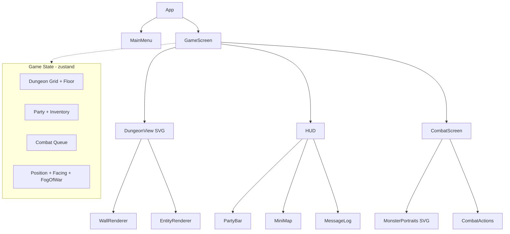

# SVG Dungeon Crawler - React Game

## Tech Stack

- **Vite + React 18 + TypeScript** - fast dev, great code splitting support
- **Pure SVG** - all graphics rendered as React SVG components (no images, no canvas)
- **zustand** - lightweight state management (1kb, perfect for game state)
- **localStorage** - save/load with multiple save slots
- **React.lazy + Suspense** - lazy load dungeon floors and monster sets

## Architecture Overview




## Core SVG Rendering Approach

The first-person dungeon view uses **layered SVG polygons** to create the classic Wizardry perspective illusion:

- The dungeon is a 2D grid internally
- Player has position (x, y) and facing (N/S/E/W)
- We ray-cast forward 4 depth levels to determine visible walls
- SVG trapezoids for side walls, rectangles for front walls, each smaller at greater depth
- This creates the 3D corridor illusion with pure geometry -- no 3D math needed

```
Depth 0 (closest)    Depth 1         Depth 2        Depth 3 (far)
+--+----------+--+  +--+------+--+  +--+----+--+   +--+--+--+
|  |          |  |  |  |      |  |  |  |    |  |   |  |  |  |
|  |          |  |  |  |      |  |  |  |    |  |   |  |  |  |
+--+----------+--+  +--+------+--+  +--+----+--+   +--+--+--+
```

## SVG Art I Will Create

**Monster Portraits** (drawn as SVG path components):

- Skeleton Warrior, Giant Rat, Slime, Goblin, Dark Mage, Giant Spider, Troll, Wraith, Mimic, Dragon (boss)

**Character Class Portraits**:

- Warrior (helm + sword), Mage (robe + staff), Rogue (hood + daggers), Cleric (holy symbol + shield)

**Dungeon Elements**:

- Stone walls (with texture patterns), wooden doors, stairs up/down, treasure chests, torch sconces, floor tiles

**Item Icons**:

- Swords, staves, shields, potions, scrolls, armor, keys, gold

All SVG art uses `<path>`, `<polygon>`, `<rect>`, `<circle>`, `<linearGradient>`, and `<pattern>` elements with a dark fantasy color palette.

## Game Systems

### 1. Procedural Dungeon Generation

- Recursive backtracker algorithm for maze corridors
- Room carving (random rectangular rooms connected to corridors)
- Guaranteed connectivity
- Seed-based (same seed = same dungeon, enables shareable runs)
- Each floor gets progressively harder + larger
- Special rooms: stairs, treasure rooms, boss rooms
- Lazy-loaded per floor via `React.lazy()`

### 2. Party System (4 Characters)

- **Classes**: Warrior, Mage, Rogue, Cleric
- **Stats**: HP, MP, Attack, Defense, Speed, Level, XP
- **Formation**: Front row (Warrior, Cleric) takes hits; back row (Mage, Rogue) protected
- Character creation at game start (name + class for each slot)

### 3. Turn-Based Combat

- Random encounters while exploring (encounter rate per step)
- 1-4 monsters per encounter, scaled to floor depth
- Turn order based on Speed stat
- Actions: Attack, Defend, Magic, Item, Flee
- XP and gold rewards
- SVG combat scene with monster portraits and party status

### 4. Inventory and Equipment

- Weapons (boost Attack), Armor (boost Defense), Accessories
- Consumables: Health Potions, Mana Potions, Antidotes
- Keys for locked doors
- Loot drops from monsters + treasure chests

### 5. Spells (Mage + Cleric)

- **Mage**: Fireball (AoE damage), Ice Shard (single target), Lightning (high damage)
- **Cleric**: Heal, Cure Poison, Holy Light (undead damage), Barrier (party defense)

### 6. Save/Load System

- 3 save slots in localStorage
- Full state serialization (party, inventory, dungeon seed, floor, position, explored tiles)
- Auto-save on floor transitions
- Save file includes playtime and floor reached for slot display

### 7. Auto-Map (Minimap)

- Fog of war -- only explored tiles visible
- Shows current position and facing direction
- Persisted across saves
- SVG-rendered in the HUD corner

## File Structure

```
src/
  components/
    screens/          -- MainMenu, GameScreen, GameOver
    dungeon/          -- DungeonView, WallRenderer, DungeonElements
    combat/           -- CombatScreen, CombatActions, TurnQueue
    hud/              -- PartyBar, MiniMap, MessageLog, InventoryPanel
    svg/
      monsters/       -- SkeletonSVG, SlimeSVG, GoblinSVG, etc.
      characters/     -- WarriorPortrait, MagePortrait, etc.
      items/          -- SwordIcon, PotionIcon, etc.
      dungeon/        -- WallPatterns, DoorSVG, ChestSVG, TorchSVG
    ui/               -- Button, Modal, StatBar, Tooltip
  stores/             -- zustand stores (gameStore, combatStore)
  systems/            -- dungeonGenerator, combatEngine, lootTable
  types/              -- TypeScript interfaces
  data/               -- monster stats, item definitions, spell definitions
  utils/              -- helpers (dice rolls, seed RNG, serialization)
  App.tsx
  main.tsx
```

## Lazy Loading Strategy

- Each dungeon floor's monster set is a lazy-loaded chunk
- Combat screen lazy-loaded (not needed until first encounter)
- Inventory panel lazy-loaded
- Character creation screen lazy-loaded
- This keeps initial bundle small (menu + dungeon renderer only)

## What Makes This Impressive

- **Pure SVG art** -- no external assets, everything is code
- **Procedural generation** -- infinite replayability
- **Classic dungeon crawler feel** -- authentic Wizardry-style first-person view
- **Full RPG systems** -- party, combat, spells, items, leveling
- **Zero backend** -- runs entirely in the browser
- **Responsive** -- SVG scales to any screen size
- **Persistent** -- pick up where you left off via localStorage
- **Shareable seeds** -- "try my dungeon" by sharing a seed number

## Build Order

The implementation follows a dependency chain where each phase builds on the previous. The dungeon renderer and movement come first since everything else (combat, items, saves) depends on having a navigable world.