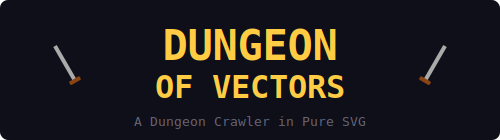
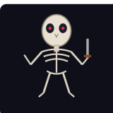
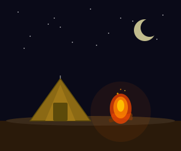

<p align="center">
  
</p>

<p align="center">
  A first-person dungeon crawler built entirely with React and SVG vector graphics.<br/>
  No sprite sheets, no images — every visual in the game is rendered with code.
</p>

<p align="center">
  <a href="https://dungeon.bldhosting.com"><strong>▶ Play Now</strong></a>
</p>

---

<p align="center">
  
</p>

<p align="center"><em>A Mad Wizard terrorizes the land. The townsfolk have hired you to put an end to his reign.</em></p>

---

## Features

<table>
<tr>
<td width="50%">

- **Pure SVG Graphics** — All dungeon walls, monsters, items, and UI are rendered as SVG. Resolution-independent and lightweight.
- **First-Person Dungeon View** — Layered perspective rendering creates the illusion of 3D corridors, doors, stairs, and treasure.
- **Procedural Generation** — Each floor is built from a seed using rooms, corridors, and maze backfilling. Dungeons grow as you descend.
- **Turn-Based Combat** — Speed-based turn order with Attack, Defend, Magic/Ability, Item, and Flee. Full keyboard and mouse support.

</td>
<td width="50%">

- **Five Character Classes** — Warrior, Mage, Rogue, Cleric, and Ranger with unique stats, growth rates, spells, and abilities.
- **Story Arc** — Hunt the Mad Wizard across 5 or 10 procedural floors, culminating in a boss fight on the final level.
- **Loot and Equipment** — Weapons, armor, accessories, and consumables from monsters and treasure chests.
- **Fog-of-War Minimap** — Reveals the dungeon as you explore with line-of-sight visibility and floor progression tracking.

</td>
</tr>
</table>

### Bestiary Preview

<p align="center">
  
  &nbsp;&nbsp;
  
  &nbsp;&nbsp;
  
</p>

<p align="center"><em>Every monster is custom SVG — animated eyes, flickering flames, crackling energy.</em></p>

---

### Rest at Camp

<p align="center">
  
</p>

<p align="center"><em>Set up camp, watch the sparks rise, and heal your party before the next floor.</em></p>

---

## Tech Stack

| Layer | Technology |
|-------|-----------|
| Framework | React 18 + TypeScript |
| Bundler | Vite |
| State | Zustand |
| Graphics | SVG (inline JSX) |
| Audio | Web Audio API |
| Persistence | localStorage |
| Testing | Vitest + React Testing Library |

## Getting Started

```bash
# Install dependencies
npm install

# Start the dev server
npm run dev

# Build for production
npm run build

# Run tests
npm test
```

## Controls

### Exploration

| Key | Action |
|-----|--------|
| W / Arrow Up | Move forward |
| S / Arrow Down | Move backward |
| A / Arrow Left | Turn left |
| D / Arrow Right | Turn right |
| Space | Interact / Descend stairs |
| I | Open inventory |
| Escape | Close panels |

### Combat

| Key | Action |
|-----|--------|
| 1 / W | Attack |
| 2 | Defend |
| 3 | Magic / Ability |
| 4 | Item |
| 5 | Flee |
| A / D / Arrows | Cycle targets |
| W / Enter | Confirm target |
| Escape | Cancel / Back |

## Project Structure

```
src/
  types/           Game-wide TypeScript interfaces
  utils/           Seeded RNG, direction helpers
  data/            Classes, monsters, items, spells, abilities
  systems/         Dungeon generator, combat engine, loot tables, audio
  stores/          Zustand game store
  components/
    screens/       Main menu, character creation, intro, victory, game over
    dungeon/       First-person SVG dungeon renderer
    combat/        Combat screen with keyboard + mouse support
    hud/           Minimap, party bar, message log, inventory
    svg/           Monster sprites, character portraits, item icons, scenes
    ui/            Reusable Button, StatBar, Modal components
```

## License

MIT
